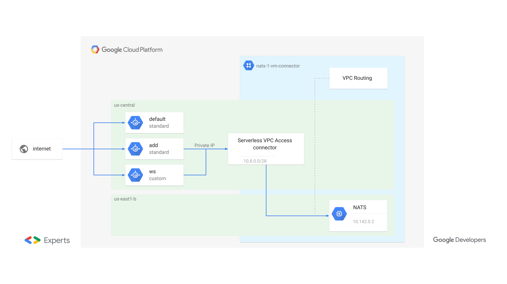
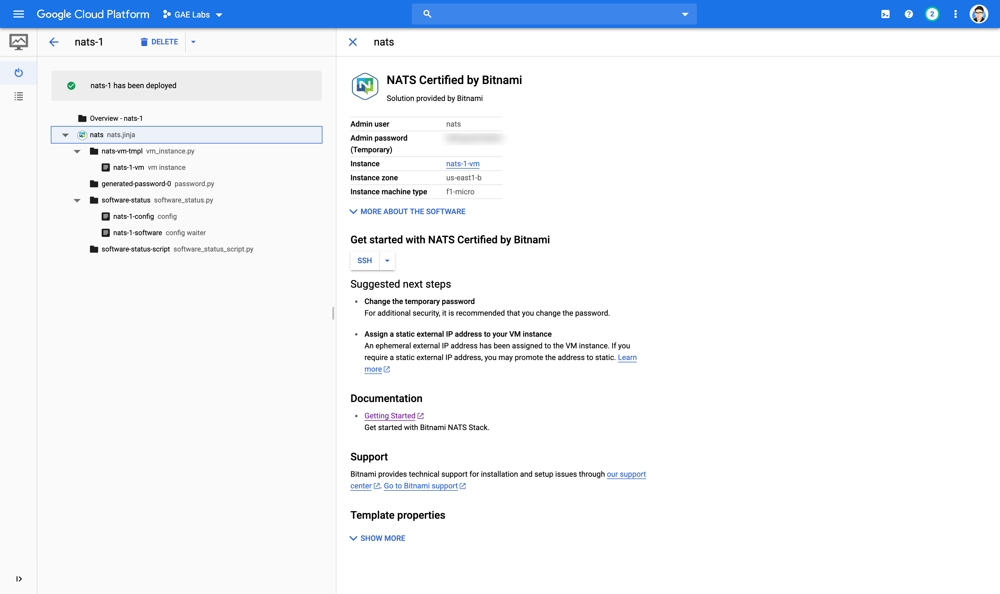
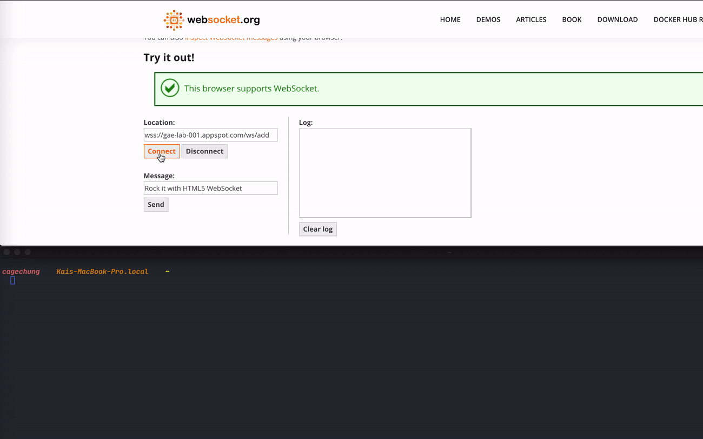

在設計 API server 的時候會有遇到即時訊息傳遞的需求，同步可以用 GRPC 建立連線來溝通，為了降低系統的耦合性，可以選擇非同步的方式。而 PubSub 結合 websocket 是常用的方式。對於一位 Gopher 來說，[NATS](https://nats.io/) 是 [CNCF](https://www.cncf.io/) 下面中關於訊息傳遞的開源專案且對 Golang 友善(比 Kafka 好多了 XD)，選擇 [NATS](https://nats.io/) 的 PubSub 功能搭配 websocket 好像也是一個合理的選擇

<!-- more -->

在 Google App Engine 上搭建整個系統需要幾個知識點，讓我們一個一個來解釋，最後會附上完整的程式碼

Google App Engine 有一個很棒的功能是非常容易的建立 service，每一個 service 可以類比成 microservice。現在已經支援了 `Python`, `Java`, `Node.js`, `PHP`, `Runy`, `Go` 等幾種程式語言，也可以在 standard, flex, custom runtime (打包成 Docker 就不受到程式語言限制了) 中進行混搭，怎麼搭配就看題目進行選擇

不囉嗦，先看整個架構圖


這邊我們有 3 個 service + 1 個 Google compute engine instance

1. default (`us-central1`): 每一個 Google App Engine 一定要有一個 default service 且要第一個進行部署
2. add (`us-central1`): 核的的 service，提供 2 個 API，`sum` 和 `concat`
3. ws (`us-central1`): 透過 [NATS](https://nats.io/) 的 client library + gorilla websocket 來實作
4. NATS (`asia-east1-b`): NATS 的 server

## 知識點

#### ## Google App Engine 上實作 websocket 只能使用 flex or custom runtime 

這個是一個基本限制，如果在 Google App Engine 上有建立 websocket 的需求，只能選擇 `flex` or `custom` runtime. Google 官網有好幾個程式語言的範例[^1]

#### ## 部著 NATS server

稍早提過，[NATS](https://nats.io/) 是 [CNCF](https://www.cncf.io/) 下面中關於訊息傳遞的開源專案且可以視為 cloud native (rock)，部署一個 NATS server 非常簡單。docker 就可以跑了，在 Google Cloud Platfrom 上我們可以透過 [Cloud Deployment Manager](https://cloud.google.com/deployment-manager) 一鍵部署一個 NATS Certified by Bitnami



部著成功之後可以查看到相關的訊息，包含要連線的密碼

#### ## Google App Engine Access NATS server via Serverless VPC

當我們一開始建立 Google App Engine 專案時我問我們要部署在什麼 region

- `northamerica-northeast1` (Montréal)
- `us-central` (Iowa)
- `us-west2` (Los Angeles)
- `us-west3` (Salt Lake City)
- `us-east1` (South Carolina)
- `us-east4` (Northern Virginia)
- `southamerica-east1` (São Paulo)
- `europe-west` (Belgium)
- `europe-west2` (London)
- `europe-west3` (Frankfurt)
- `europe-west6` (Zürich)
- `asia-northeast1` (Tokyo)
- `asia-northeast2` (Osaka)
- `asia-northeast3` (Seoul)
- `asia-east2` (Hong Kong)
- `asia-south1` (Mumbai)
- `australia-southeast1` (Sydney)

> asia 中日本，韓國，香港都有，台灣就是沒有，表示哭哭

當我們使用 standard runtime 建立的應用程式有需要跟我們自己建立的 Google compute engine instance 進行溝通時，就必需透過 `VPC` 進行連線，阿不是在 GCP 專案下的機器是相通的嗎？
> 一個簡單的判別方式，如果服務可以讓你設定 `network` 相關的設定就是；Google app engine standard runtime `app.yaml` 並沒有 `network` 相關可以配置的設定 (flex, custom runtime 中有)。而在 standard runtime 的 `beta` 中可以讓我們在 `app.yaml` 透過指定 `vpc_access_connector` 來 [Configuring Serverless VPC Access](https://cloud.google.com/vpc/docs/configure-serverless-vpc-access) 存取 Google compute engine[^2] 上相關的資源

#### ## 透過 cloudbuild 部署整個 app engine application 需要的啟用的 API及權限

```bash
$ gcloud app GROUP | COMMAND [GCLOUD_WIDE_FLAG ...]
```

部署 Google app engine 的方式為使用 `gcloud` command，當數量少的時候可以手動進行部署，不過當 `service` 數量多時候，手動部署是很累人的，所以透過 [Cloud Build](https://cloud.google.com/cloud-build) 就是一個簡單的方式，要注意的部份是，在 local 時是以 `gcloud auth` 的身份進行部署，不過在 cloud build 中是透過 cloud build 的 service account (`xxx@cloudbuild.gserviceaccount.com`), 所以需在啟用相關的 API 及配置相關應的權限給 cloud build 的 service account 才不會報錯

需要特別啟用的 API
- Cloud Build API
- App Engine Admin API: 在 Cloud build 中的設定直接 enable 就好
- Serverless VPC Access API

__cloudbuild.yaml__

```yaml
timeout: 1200s # 20 mins
steps:
  - id: deploy website
    name: gcr.io/cloud-builders/gcloud
    args:
      - app
      - deploy
      - website/app.yaml
      - --version=$SHORT_SHA
      - --project=$PROJECT_ID
      - -q

  - id: deploy add service
    name: gcr.io/cloud-builders/gcloud
    args:
      - beta
      - app
      - deploy
      - cmd/add/app.yaml
      - --version=$SHORT_SHA
      - --project=$PROJECT_ID
      - -q

  - id: build ws
    name: gcr.io/cloud-builders/docker
    entrypoint: bash
    args:
      - -exc
      - |
        docker build --tag gcr.io/$PROJECT_ID/ws:$COMMIT_SHA --tag gcr.io/$PROJECT_ID/ws:$SHORT_SHA --file Dockerfile.ws .
        docker push gcr.io/$PROJECT_ID/ws:$COMMIT_SHA
        docker push gcr.io/$PROJECT_ID/ws:$SHORT_SHA

  - id: deploy ws service
    name: gcr.io/cloud-builders/gcloud
    args:
      - beta
      - app
      - deploy
      - cmd/ws/app.yaml
      - --version=$SHORT_SHA
      - --project=$PROJECT_ID
      - --image-url=gcr.io/$PROJECT_ID/ws:$SHORT_SHA
      - -q

  - id: deploy disptach
    name: gcr.io/cloud-builders/gcloud
    args:
      - app
      - deploy
      - dispatch.yaml
```

cloud build 中的流程是
1. deploy website: default service, golang standard runtime
1. deploy add: add service, golang standard runtime
1. build ws docker image and push to gcr.io
1. deploy ws service, golang custom runtime
1. update disptach

需要配置以下權限給 cloud build service account
1. `App Engine Admin`: cloud build deploy Google app engine
1. `Cloud Build Service` Account: (default)
1. `Compute Network User`: Access network
1. `Serverless VPC Access User`: The "vpcaccess.connectors.use" permission is required.

## demo



> Google app engine 還有一個佛心的部份就是自帶 HTTPS，所以我們實作的 websocket entrypoint 也可從 `ws://` 直接轉成 `wss://` (rock)

## repo

https://github.com/cage1016/gae-custom-ws

## Reference
[^1]: [Creating Persistent Connections with WebSockets](https://cloud.google.com/appengine/docs/flexible/go/using-websockets-and-session-affinity), 換程式語言也對應到相關的範例
[^2]: 現在 `vpc_access_connector` 屬於 beta，所以在需要使用 `gcloud beta app deploy ...`